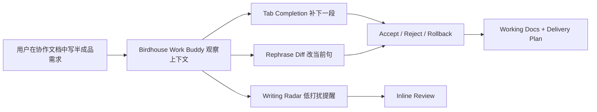

<h1 align="center">doc-as-IDE：AI 文档过程补全工作台</h1>

<p align="center">
  让 PM 跟工程师一样用上能够信息补全和自动联想的办公效率产品（跟用 IDE 一样）
</p>

<p align="center">
  
  
  
</p>

## 项目定位

doc-as-IDE 是一个面向 B 端企业协作文档场景的 AI 写作过程引擎。它的核心不是“再做一个文档编辑器”，也不是“一键生成整篇 PRD”，而是把工程师已经熟悉的 IDE 工作方式迁移到 PM、BD、运营、交付团队的日常文档流里：Tab 补齐、Next Edit、选区 rephrase、inline review、diff 接受/拒绝/回滚、工作状态透出和交付检查。

当前 MVP 以 Feishu Docs 风格页面承载演示，因为飞书是典型的企业协作入口。但产品定义不绑定飞书插件。更大的路径是让 coding 的逻辑和工作模式普惠到所有主流办公效率协作 SaaS，包括 Notion、飞书、钉钉、Teams、Google Docs、Slack、Amazon Quick Suite 等。

## 为什么不是整篇文档生成

主流办公效率 SaaS 已经在做知识库问答、摘要、翻译、会议纪要、工作流和整篇文档生成。但 PRD/MRD/BD 方案写作的高频卡点，通常发生在“过程”中：下一段该写什么，这句话怎么变成团队标准表达，指标有没有当前值和目标值，验收标准能不能测试，AI 建议有没有来源，改错后能不能回滚。

因此 doc-as-IDE 追求一个更高频、更可控的中间态：用户仍然自己写文档，AI 在字里行间做补齐、重写、提醒和评审，把半成品 file 重整成可以直接进入评审和交付的 working docs。

## 当前 MVP 能力

- `Tab Completion`：根据当前文档、缺失章节、团队 PRD/MRD 样例和补齐设置生成 ghost suggestion，用户按 Tab 接受。
- `Next Edit Suggestion`：像 AI IDE 一样同时预测“当前句该怎么重写”和“下一段该补什么”。
- `Rephrase Diff`：对选区做局部改写，结果以 diff 形式出现，支持接受、拒绝和 rollback token 回滚。
- `MBTI Style`：MBTI 只作为 AI 回复和改写语言风格控制器，不改变事实判断、证据来源和交付规则。
- `Assistant / Reminder Mode`：Assistant 主动参与写作；Reminder 低打扰观察空白页、停留时间、缺失章节、评审风险和交付节点。
- `Birdhouse Work Buddy`：右下角鸟屋桌宠状态层，用小尺寸自适应浮窗展示 idle、working、warning、celebrate 等 agent 状态。
- `Writing Radar`：在写作时提示“这段缺用户证据”“指标缺当前值/目标值”“这条需求可拆成验收标准”等。
- `Delivery Trace`：每条建议展示来源，说明命中了哪些历史 PRD/MRD 样式、术语、验收库或交付规则。
- `Markdown Export`：导出带评审摘要、质量快照和交付建议的 working docs。

## 补齐设置

MVP 内置 `completion_settings`，用于说明 Tab 优先补什么。真实产品里这些设置可以成为团队级或个人级偏好。

- `SECTION_FIRST_COMPLETION`：空白页或初稿阶段优先补背景、目标、范围、验收、指标、风险等核心章节。
- `ACCEPTANCE_COMPLETION`：当功能需求已有但缺少可测试口径时，优先补 Given/When/Then 或检查项。
- `STYLE_REPHRASE_DIFF`：根据当前 MBTI 回复语言风格重写选区，并以可回滚 diff 呈现。
- `METRIC_AND_RISK_RADAR`：Reminder Mode 下低打扰提示指标、风险、用户证据和 owner 缺口。
- `DELIVERY_TASK_PROJECTION`：核心章节基本齐备后，把文档投影为产品、设计、研发、测试检查点。

## MBTI 风格化回复语言

这里的 MBTI 不是人格测试，也不是让模型改变事实判断。它只影响 AI 回复、rephrase、review 的表达风格。内部 persona key 保持英文 canonical，UI 和输出可以是中文。

- `INTJ_ARCHITECT`：战略清晰、面向未来、逻辑锋利，适合边界、依赖和长期架构影响。
- `ENTJ_COMMANDER`：目标明确、决策果断、强调优先级、owner 和结果，适合交付推进。
- `INFJ_ADVOCATE`：有共情、有愿景、温和引导，适合用户价值和团队共识表达。
- `ENFP_CAMPAIGNER`：有画面感、可能性导向、情绪能量更高，适合机会叙事和创意扩写。

MBTI 原始风格约束来自 [docs/mbti_profiles.csv](docs/mbti_profiles.csv)，知识包会把 `mbti_do`、`mbti_avoid` 映射到 persona profile 中。

## 产品形态



当前页面是 Feishu-style shell，但真正要验证的是 SaaS-agnostic 的过程增强能力：只要能读到当前文档、选区、光标和团队知识资产，就能把主流协作 SaaS 的文档页增强成 doc-as-IDE。

## 技术结构

```text
.
├── data/prd_knowledge_pack.json      # seeded PRD/MRD knowledge pack, personas, modes, settings
├── docs/mbti_profiles.csv            # MBTI language style source definitions
├── docs/ref/                         # logo and visual reference assets
├── src/app.py                        # Flask single-page app and /workspace endpoint
├── src/prd_engine.py                 # deterministic PRD delivery engine
├── src/prd_skills.py                 # English canonical skill registry
├── templates/dashboard.html          # Feishu-style doc-as-IDE demo UI
└── tests/test_app.py                 # endpoint, UI smoke, regression tests
```

内部 skill 和 schema 坚持英文 canonical，避免后续接入模型、工具、API 时出现语义漂移。当前主要 skill 包括：`StyleProfiler`、`RequirementCompleter`、`RewriteEditor`、`AcceptanceCriteriaBuilder`、`RiskReviewer`、`TaskPlanner`、`TraceExplainer`、`PersonaStylist`、`ReminderPlanner`、`RollbackManager`。

## API

所有能力保留在单入口 `POST /workspace`，方便前端和未来 SaaS adapter 复用。

```json
{"action":"load_prd_demo","demo_id":"doc_as_ide"}
```

```json
{"action":"next_edit_suggest","current_text":"# PRD...","persona":"ENTJ_COMMANDER"}
```

```json
{"action":"apply_persona_rewrite","persona":"ENFP_CAMPAIGNER","selected_text":"让新人更快写需求","current_text":"# PRD..."}
```

```json
{"action":"inline_review","current_text":"# PRD..."}
```

```json
{"action":"rollback_suggestion","rollback_token":"...","current_text":"# PRD..."}
```

```json
{"action":"reminder_snapshot","current_text":"# PRD...","idle_seconds":90}
```

关键响应字段包括：`ghost_text`、`inline_diff`、`rollback_token`、`persona_profile`、`completion_settings`、`evidence_refs`、`delivery_trace`、`quality_metrics`、`missing_sections`、`risk_flags`、`reminder_cards`、`mascot_state`。

## 本地运行

建议使用虚拟环境运行。

```bash
python3 -m venv .venv
source .venv/bin/activate
pip install -r requirements.txt
python -m src.app
```

打开浏览器访问：

```text
http://127.0.0.1:5000
```

当前 MVP 是 deterministic offline fallback，不依赖模型 key，不依赖真实飞书、Notion 或 Google 账号。

## 测试

```bash
python3 -m pytest -q
pytest -q
```

测试覆盖：

- 首页渲染 doc-as-IDE、鸟屋浮窗、补齐设置和 MBTI 风格化回复语言。
- `/workspace` 的 demo loading、inline suggestion、rewrite、review、rollback、reminder、export。
- 内部 skill、persona、mode、completion setting 保持英文 canonical。
- UI 输出和报告输出保持中文。
- 离线 fallback 在没有模型 key 时仍可稳定演示。

## 演示脚本

1. 打开首页，说明这是 `doc-as-IDE`：把协作文档写作过程变成类似 IDE 的工作流。
2. 指出当前是 Feishu-style shell，不是最终只做飞书插件；未来可接入 Notion、飞书、钉钉、Teams、Google Docs 等。
3. 在正文输入一句半成品需求，例如“我们希望提升 PRD 写作效率”。
4. 点击 `Next Edit 联想`，展示当前句 rephrase diff 和下一段 ghost completion。
5. 按 `Tab 接受`，说明这对应 VS Code/Cursor 式 Tab Completion。
6. 在右侧切换 `ENTJ_COMMANDER` 或 `ENFP_CAMPAIGNER`，展示同一段内容的不同回复语言风格。
7. 运行 `@review`，展示 inline review、风险提示和 rollback token。
8. 切换 Reminder Mode，展示小鸟如何低打扰提示缺章节、缺验收、缺指标和交付风险。
9. 点击 `交付检查` 或 `Export PRD`，展示 working docs 可以进入评审和交付。

## 后续路线

- v1：强化 doc-as-IDE MVP 的写作过程魔法，重点是 Tab 补齐、MBTI 风格化回复、可回滚 diff 和鸟屋状态层。
- v2：接入真实文档 adapter，优先验证 Feishu Docs / Notion / Google Docs 的当前文档、选区、评论和权限模型。
- v3：接入企业知识库和任务系统，把 PRD/MRD、会议纪要、项目复盘和交付状态做跨页面检索。
- v4：支持团队级补齐策略、风格画像、权限隔离、审计日志和交付数据回流。

## 边界

当前 MVP 不登录真实 SaaS 账号，不读取企业私有文档，不创建飞书任务、群消息或 Base 数据。它验证的是一个产品形态和过程体验：让 PM/BD/运营/交付在自己熟悉的协作文档里，像工程师使用 IDE 一样获得补齐、联想、重构、评审、回滚和交付追踪。
