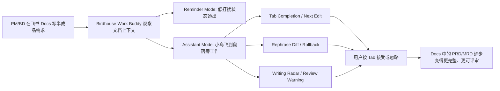

<h1 align="center">Flash of Insights：飞书 Docs as IDE 需求写作助手</h1>

<p align="center">
  让 PM/BD 在飞书 Docs 中写需求时，像工程师在 IDE 中写代码一样获得补全、改写、评审、提醒和回滚。
</p>

<p align="center">
  
  
  
  
</p>

## 一句话定位

本项目展示的是一个面向 PM/BD 需求写作过程的 AI 助手：用户仍然在飞书 Docs 里写 PRD/MRD，鸟舍桌宠作为低打扰的状态层和入口，让原本的文档页面具备类似 IDE 的 `Tab Completion`、`Next Edit`、`Rephrase Diff`、`Writing Radar`、`Review Warning` 和 rollback 能力。

它不是一个新的独立文档编辑器，也不是整篇 PRD 代写器。核心目标是改变 PM/BD 在飞书 Docs 中写需求、补需求、评审需求的过程体验，让半成品需求在写作过程中持续被补齐、改写和检查，而不是等文档写完后再做一次总结或流转。

## 核心产品定义

当前产品设想基于三个判断：

1. PM/BD 的高频卡点发生在写作过程中，而不是只发生在文档完成之后。
2. 飞书 Docs 已经是团队协作和需求沉淀的主场景，产品不应该强迫用户离开 Docs 去另一个独立工具里写需求。
3. AI IDE 的过程补全、局部改写、可回滚 diff 和状态可视化，适合迁移到 PRD/MRD 写作场景。

因此，产品形态是“飞书 Docs + Birdhouse Work Buddy”，而不是“三栏 dashboard + chatbot”。桌宠 UI 负责陪伴、状态透出和轻量召唤；真正的 AI 能力发生在文档字里行间。

## 当前 MVP 展示什么

当前 demo 是 deterministic offline MVP，不依赖模型 key，也不登录真实飞书账号。它重点展示最终产品的核心体验形态：

- **高保真飞书 Docs 风格页面**：首页不再是独立 PRD IDE dashboard，而是接近飞书 Docs 的文档页面、顶部栏、协作头像、左侧目录和中央文档纸张。
- **Birdhouse Work Buddy**：右下角鸟舍/桌宠悬浮球作为入口和状态层，默认低打扰驻留。
- **Reminder Mode**：鸟舍在不打断用户的情况下透出 agent 状态，例如 idle、scanning、warning、result ready。
- **Assistant Mode**：当用户触发建议、停顿或运行指令时，小鸟从鸟舍飞出，靠近当前段落，表现为“在文档字里行间 working”。
- **Tab Completion / Next Edit**：根据当前光标、缺失章节、团队风格和交付规则生成下一段 ghost suggestion，用户按 `Tab` 接受。
- **Rephrase Diff + Rollback**：AI 不直接覆盖正文，而是生成可接受、可拒绝、可回滚的局部 diff。
- **Writing Radar**：对当前文档段落做轻量扫描，提示“缺用户证据”“指标缺 baseline/target”“方案先于问题”“这条需求可拆成验收标准”等。
- **Review Warning**：在 `@review` 或评审动作中指出 PRD 的缺口、风险和可验收性问题。
- **Debug Drawer**：保留 Context Pack、Skills、Rules、Quality、Risk、Trace、Delivery Plan 等调试信息，但默认收起，不进入用户主视野。

## 不做什么

为了避免产品叙事跑偏，当前 MVP 刻意不做以下内容：

- 不替代飞书 Docs，不做新的企业文档系统。
- 不做整篇 PRD 自动生成器。
- 不主打任务拆解、IM 群通知、Base/Sheets 写入或需求流转自动化。
- 不接入真实飞书账号、企业权限和 OAuth。
- 不在当前演示中调用 `larksuite/cli`。

这些能力可能是未来企业落地的一部分，但不是当前 MVP 的主演示目标。当前最重要的是证明：在飞书 Docs 的原生写作场景中，PM/BD 可以通过桌宠 UI 获得 IDE 式的过程增强。

## 产品流程



## 交互模式

### Reminder Mode

`Reminder Mode` 是默认状态。鸟舍停留在右下角，只在关键节点通过状态灯、轻微动效和气泡透出信息。

适合表达：

- agent 正在读取当前文档结构；
- 当前段落存在潜在缺口；
- 文档停留时间较长，可能需要下一步建议；
- review warning 已准备好；
- 结果已生成，可以回到文档处理。

### Assistant Mode

`Assistant Mode` 是主动协作状态。小鸟会从鸟舍飞出，靠近当前段落或选区，给出局部建议。

适合表达：

- 光标处生成下一段 ghost suggestion；
- 对选区生成 rephrase diff；
- 在当前段落旁标记 Writing Radar；
- 对风险和验收标准做 inline review；
- 支持接受、拒绝和 rollback。

## 系统能力

核心能力由离线 deterministic engine 提供，便于比赛现场和 review 环境稳定演示。

- `Tab Completion`：根据当前文本和缺失章节生成下一段建议。
- `Next Edit Suggestion`：同一次建议返回补齐内容、改写建议、下一处 cursor target 和 evidence refs。
- `Rephrase Diff`：把模糊需求改写成更接近团队 PRD 风格的表达。
- `RollbackManager`：为 diff 生成 rollback token，避免 AI 直接破坏用户原文。
- `WritingRadar`：扫描当前 working cell，提示结构缺口和可补齐动作。
- `RiskReviewer`：检查验收标准、成功指标、范围边界和风险前置。
- `PersonaStylist`：支持 `INTJ_ARCHITECT`、`ENTJ_COMMANDER`、`INFJ_ADVOCATE`、`ENFP_CAMPAIGNER` 等写作人格。
- `TraceExplainer`：解释建议来自哪些团队风格、术语、模板或交付规则。

## 未来飞书落地路径

当前 MVP 不调用真实飞书能力，但保留后续接入方式。

后续真实产品可通过飞书 Docs API 或 `larksuite/cli` 承接：

- 文档读写：读取当前 Docs 内容，将补齐/改写结果写回文档。
- 光标与选区：获取当前段落、选区、光标位置，作为 `current_text`、`selected_text`、`cursor_position` 的真实来源。
- 评论/批注：把 Review Warning 或 Writing Radar 以评论、批注或侧边建议形式落在文档局部。
- 权限认证：处理企业账号、文档权限、OAuth、Bot 权限和 workspace 安全边界。
- 版本与回滚：把 rollback token 映射到真实文档变更记录或建议状态。

`larksuite/cli` 在这里是未来真实落地的参考路径，不进入当前 MVP 主演示流。当前 demo 只展示“飞书 Docs 被桌宠 UI 增强为 IDE 式写作界面”的核心体验。

## 代码结构

- `src/prd_engine.py`：核心离线 deterministic engine，负责补全、改写、人格、评审、写作雷达、提醒、回滚、交付检查和导出。
- `src/prd_skills.py`：英文 canonical skill registry，包括 `StyleProfiler`、`RequirementCompleter`、`RewriteEditor`、`AcceptanceCriteriaBuilder`、`RiskReviewer`、`TaskPlanner`、`TraceExplainer`、`PersonaStylist`、`ReminderPlanner`、`RollbackManager`。
- `data/prd_knowledge_pack.json`：seeded PRD/MRD knowledge pack，包含市场分析、pet states、writing radar rules、persona profiles、section templates 和 delivery rules。
- `templates/dashboard.html`：当前 MVP 主界面，呈现飞书 Docs 风格页面、桌宠悬浮球、字里行间建议、Debug Drawer 和现有 engine 能力。
- `docs/ref/`：视觉参考资源，包括 `logo1.png`、`logo2.png`、`logo3.png`、`MBTI.png` 和需求 PDF。

## API 设计

`GET /` 渲染 MVP 单页应用。所有产品动作统一走 `POST /workspace`。

核心 actions：

- `refresh`
- `load_prd_demo`
- `inline_suggest`
- `next_edit_suggest`
- `rewrite_selection`
- `review_prd`
- `generate_delivery_plan`
- `quality_snapshot`
- `export_prd`

Assistant / pet actions：

- `switch_agent_mode`
- `assistant_command`
- `apply_persona_rewrite`
- `inline_review`
- `rollback_suggestion`
- `reminder_snapshot`

请求示例：

```json
{"action":"next_edit_suggest","persona":"ENTJ_COMMANDER","current_text":"# PRD\n\n## 背景\n我们希望提升 PRD 写作效率"}
```

```json
{"action":"assistant_command","command":"@review 请检查验收标准","current_text":"# PRD\n\n## 背景\n..."}
```

```json
{"action":"reminder_snapshot","current_text":"# PRD\n\n## 背景\n系统需要支持自动联想和内容重整。","idle_seconds":120}
```

重点响应字段：

- `ghost_text`
- `replacement_text`
- `inline_diff`
- `rollback_token`
- `evidence_refs`
- `delivery_trace`
- `quality_metrics`
- `missing_sections`
- `risk_flags`
- `agent_mode`
- `mascot_state`
- `pet_state`
- `pet_profile`
- `pet_bubble`
- `radar_cards`
- `milestone_cards`

## 本地启动

```bash
python3 -m venv .venv
source .venv/bin/activate
pip install -r requirements.txt
python -m src.app
```

Windows PowerShell：

```powershell
python -m venv .venv
.\.venv\Scripts\python.exe -m pip install -r requirements.txt
.\.venv\Scripts\python.exe -m src.app
```

默认地址：

```text
http://127.0.0.1:5000
```

也可以使用脚本：

```bash
./start_server.sh
```

```powershell
.\start_server.ps1
```

## 配置

```bash
PRD_KNOWLEDGE_PACK_PATH=
HOST=127.0.0.1
PORT=5000
```

如果 `PRD_KNOWLEDGE_PACK_PATH` 为空，系统默认使用 `data/prd_knowledge_pack.json`。

## 验证

```bash
python -m src.preprocess data/prd_knowledge_pack.json
python -m pytest -q
```

当前 demo 是 deterministic offline fallback，不依赖模型 key，不依赖真实飞书账号。

## 演示脚本

1. 打开 `http://127.0.0.1:5000`，说明这是“飞书 Docs as IDE”的高保真 MVP，而不是独立 dashboard。
2. 在文档正文中输入一句模糊需求，例如：`我们希望更好地帮助 PM 自动完善需求`。
3. 观察右下角鸟舍在 `Reminder Mode` 下透出状态，提示当前段落存在结构缺口。
4. 点击 `Next Edit 联想`，小鸟进入 `Assistant Mode`，在文档旁生成 ghost suggestion。
5. 按 `Tab` 接受补齐内容，展示类似 IDE 的内容补全体验。
6. 选中一句话后触发 `Rephrase 选区`，展示 inline diff、接受/拒绝/回滚。
7. 输入或运行 `@review 请检查验收标准`，展示 Writing Radar 和 Review Warning。
8. 打开 `Debug Drawer`，说明底层 evidence refs、quality、risk、trace 和 delivery check 仍然存在，但默认不打扰用户。
9. 结尾强调：产品改变的是 PM/BD 在飞书 Docs 中交付需求的过程体验，而不是把需求写完后再做任务或 IM 流转。

## 给仓库所有者的 Review 说明

本次改动的核心是重新对齐产品叙事和 MVP 展示形态。

旧版本首页更像一个独立的三栏 PRD IDE dashboard：左侧 Context Pack，中间编辑器，右侧 AI Work Buddy。它能展示 engine 能力，但容易让评审者误解为“我们做了另一个文档工具”。

这次改动把默认首页改成接近飞书 Docs 的写作界面：用户看到的主体仍然是 Docs，鸟舍桌宠只是入口和状态层，AI 能力贴着正文发生。这样更符合最终产品定义：通过桌宠 UI 把飞书 Docs 变成类似 IDE 的 PM/BD 需求写作界面。

建议重点 review：

- 首页是否足够像飞书 Docs 中的写作场景；
- 桌宠是否清楚表达了 `Reminder Mode` 和 `Assistant Mode`；
- `Next Edit`、`Tab Completion`、`Rephrase Diff`、`Writing Radar` 是否更像“字里行间”的能力，而不是 dashboard 控件；
- `Debug Drawer` 是否足够保留原有 engine 可解释性，同时不干扰主演示；
- README 是否清楚说明当前 MVP 不接入真实飞书、不做 Tasks/IM/Base 自动化，只保留后续飞书 Docs API / `larksuite/cli` 接入路径。

当前保持 offline/mock 的部分：

- 不登录真实飞书账号；
- 不读取真实 Docs 选区和光标；
- 不写回真实 Docs；
- 不创建飞书任务、群消息或 Base 数据；
- 不处理企业权限和 OAuth。

这些是后续真实产品落地阶段要解决的问题，不是当前 MVP 的主验证目标。
