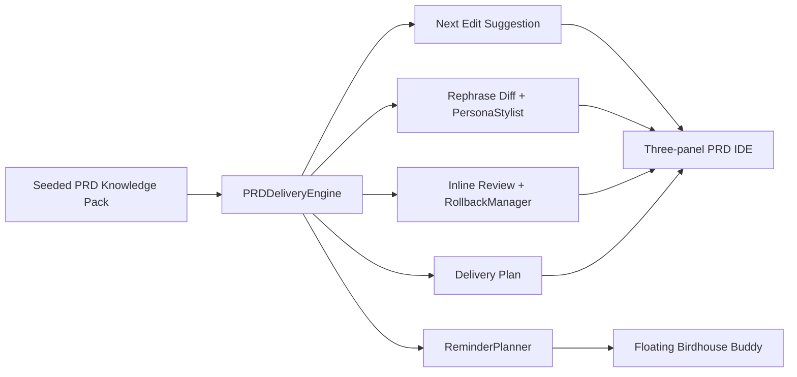

<h1 align="center">Flash of Insights：PRD IDE 需求交付引擎</h1>

<p align="center">
  让PM跟工程师一样用上能够信息补全和自动联想的办公效率产品（跟用 IDE 一样）
</p>

<p align="center">
  
  
  
  
</p>

这是一个面向 AI 产品挑战赛的独立 Demo：核心 insight 不是再做一个整篇文档生成器，而是把 PRD 写作过程 IDE 化。用户自己写下半成品需求时，系统像 VS Code / Cursor / Windsurf 一样给出 `Tab` completion、Next Edit、rephrase diff、评审、回滚和交付追踪。

产品形态不是 Feishu 插件，也不是普通 chatbot。它保留三栏 PRD IDE，并用右下角鸟屋 Work Buddy 承载 `AssistantMode` / `ReminderMode`、MBTI 写作人格、inline diff 和 rollback，让评委直接看到“写需求像写代码”的中间态。

## Flash Insight

完整文档生成是多数办公效率产品都会考虑的终局能力，但 PM/BD 的高频痛点发生在写作过程中：下一段该写什么、这句话如何写成团队风格、缺了哪些验收条件、如何把半成品 file 重整成可交付 working docs。

本项目的切入点是过程补全：先让用户在 PRD/MRD 写作时获得 AI completion、Next Edit、inline rephrase 和可回滚 diff，再逐步扩展到跨系统 agentic delivery。

## Product Shape

- `NextEditSuggestion`：同一次建议返回 `ghost_text`、`rewrite_hint`、`cursor_target`、`suggestion_kind`、`inline_diff` 和 `rollback_token`。
- `ReminderMode`：默认低打扰鸟屋浮窗，监控空白页、停留时间、缺失章节、长段落和交付风险，只在关键节点提示。
- `AssistantMode`：小鸟从鸟屋展开，主动参与写作，支持 `Tab` 补全、Next Edit、选区改写、`/assistant` 指令、`@mbti` 人格风格和 `@review` inline review。
- `MBTI Personas`：内置 `INTJ_ARCHITECT`、`ENTJ_COMMANDER`、`INFJ_ADVOCATE`、`ENFP_CAMPAIGNER` 四个英文 canonical persona key，中文只作为 UI 展示。
- `Inline Diff + Rollback`：AI 建议以可接受、可拒绝、可回滚的 diff 展示，避免一次性覆盖用户草稿。
- `Seeded PRD Knowledge Pack`：用内置 PRD/MRD、MRD 市场判断、复盘结论、验收样例、风格规则和交付模式模拟跨页面知识库。
- `Explainable Trace`：每次补全、改写、评审和提醒都会返回 evidence refs，说明来源于哪个样例、术语或交付规则。

## User Journey

1. 用户创建或打开 PRD 页面。
2. 右下角出现鸟屋 floating buddy，默认进入 `ReminderMode`。
3. 用户写下第一行后，小鸟探头提示是否进入 `AssistantMode`。
4. 进入 Assistant 后，用户按 `Tab` 接受文内补全；同一条 Next Edit 建议还会给出当前句 rephrase diff，可接受、拒绝或回滚。
5. AI 输出建议时展示来源、人格、风险和可回滚 diff。
6. Work Buddy 评审 PRD 完整度，生成交付计划，并导出 Markdown 结果物。

## Shortcuts

- `Tab`：接受当前 ghost suggestion。
- `Esc`：取消当前 ghost suggestion。
- `Cmd/Ctrl + K`：改写选区。
- `Cmd/Ctrl + Enter`：触发 Work Buddy inline review。

## Architecture



核心代码：

- [src/prd_engine.py](/Users/samxie/Research/Agent-Promotion/ai-driven-end-to-end-demand-delivery-engine/src/prd_engine.py)：`PRDDeliveryEngine`，负责补全、改写、review、persona、reminder、rollback、delivery plan 和 export。
- [src/prd_skills.py](/Users/samxie/Research/Agent-Promotion/ai-driven-end-to-end-demand-delivery-engine/src/prd_skills.py)：English canonical skill registry，包括 `StyleProfiler`、`RequirementCompleter`、`RewriteEditor`、`PersonaStylist`、`ReminderPlanner`、`RollbackManager`。
- [data/prd_knowledge_pack.json](/Users/samxie/Research/Agent-Promotion/ai-driven-end-to-end-demand-delivery-engine/data/prd_knowledge_pack.json)：Seeded PRD/MRD knowledge pack。
- [templates/dashboard.html](/Users/samxie/Research/Agent-Promotion/ai-driven-end-to-end-demand-delivery-engine/templates/dashboard.html)：三栏 PRD IDE、右下角鸟屋浮窗、persona selector 和 inline diff UI。
- [docs/ref](/Users/samxie/Research/Agent-Promotion/ai-driven-end-to-end-demand-delivery-engine/docs/ref)：`logo1.png`、`logo2.png`、`logo3.png`、`MBTI.png` 和需求 PDF 参考资源。

## API

所有产品动作通过 `POST /workspace` 进入。`GET /` 保持单页 App，`GET /assets/ref/<filename>` 用于本地参考素材。

保留动作：

- `refresh`
- `load_prd_demo`
- `inline_suggest`
- `next_edit_suggest`
- `rewrite_selection`
- `review_prd`
- `generate_delivery_plan`
- `quality_snapshot`
- `export_prd`

v2 新增动作：

- `switch_agent_mode`
- `assistant_command`
- `apply_persona_rewrite`
- `inline_review`
- `rollback_suggestion`
- `reminder_snapshot`

示例：

```json
{"action":"switch_agent_mode","agent_mode":"assistant"}
```

```json
{"action":"next_edit_suggest","persona":"ENTJ_COMMANDER","current_text":"# PRD\n\n## 背景\n我们希望提升 PRD 写作效率"}
```

```json
{"action":"assistant_command","command":"@review 请检查验收标准","current_text":"# PRD\n\n## 背景\n..."}
```

```json
{"action":"apply_persona_rewrite","persona":"INTJ_ARCHITECT","selected_text":"提升 PRD 写作效率","current_text":"# PRD\n\n提升 PRD 写作效率"}
```

响应中会按场景返回：`ghost_text`、`suggestion_kind`、`rewrite_hint`、`cursor_target`、`replacement_text`、`inline_diff`、`rollback_token`、`agent_mode`、`mascot_state`、`persona_profile`、`reminder_cards`、`emotion_state`、`evidence_refs`、`delivery_trace`、`quality_metrics`、`missing_sections`、`risk_flags`。

## Knowledge Pack Contract

`data/prd_knowledge_pack.json` 使用英文稳定 key，中文只用于 UI 文案和生成内容。v2 必备 top-level keys：

- `workspace`
- `challenge_story`
- `flash_insight`
- `market_landscape`
- `style_fingerprints`
- `glossary`
- `delivery_rules`
- `section_templates`
- `demo_documents`
- `rewrite_modes`
- `next_edit_patterns`
- `cross_page_assets`
- `writing_journey_states`
- `agent_modes`
- `mascot_assets`
- `persona_profiles`
- `assistant_commands`
- `reminder_rules`
- `rollback_policy`

## Assets

- `docs/ref/logo2.png`：默认 `ReminderMode` / idle floating birdhouse。
- `docs/ref/logo3.png`：`AssistantMode` 展开态 mascot。
- `docs/ref/logo1.png`：landing hero / brand card。
- `docs/ref/MBTI.png`：persona selector 视觉参考，不做强依赖切片。

## Quick Start

```bash
python3 -m venv .venv
source .venv/bin/activate
pip install -r requirements.txt
python -m src.app
```

也可以使用脚本：

```bash
./start_server.sh
```

默认地址为 `http://127.0.0.1:5000`。

## Configuration

`.env.example` 中最常用配置：

```bash
PRD_KNOWLEDGE_PACK_PATH=
HOST=127.0.0.1
PORT=5000
```

未配置 `PRD_KNOWLEDGE_PACK_PATH` 时，系统使用仓库内置 [data/prd_knowledge_pack.json](/Users/samxie/Research/Agent-Promotion/ai-driven-end-to-end-demand-delivery-engine/data/prd_knowledge_pack.json)。

## Validation

```bash
pytest -q
python -m pytest -q
python3 -m src.preprocess data/prd_knowledge_pack.json
```

当前实现保持离线 deterministic fallback，不依赖模型 key 或 live Feishu / Notion / Slack / DingTalk 集成。企业集成、权限和真实跨文档索引属于 v3 范围。
