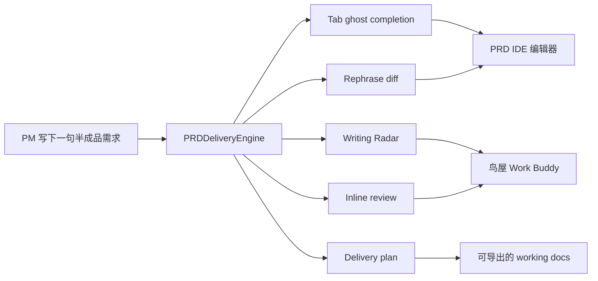
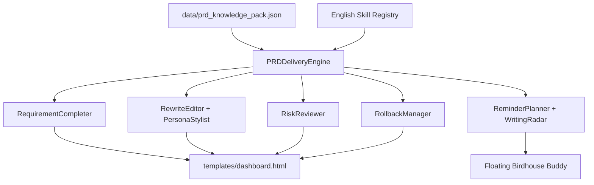

<h1 align="center">Flash of Insights：PRD IDE 需求交付引擎</h1>

<p align="center">
  让PM跟工程师一样用上能够信息补全和自动联想的办公效率产品（跟用 IDE 一样）
</p>

<p align="center">
  
  
  
  
</p>

这是一个面向 AI 产品挑战赛的独立 Demo。项目核心不是“再做一个整篇 PRD 生成器”，而是把 PM/BD 写需求的过程做成类似 VS Code、Cursor、Windsurf 的 IDE 体验：用户自己写，AI 在过程中提供 `Tab` 补全、Next Edit、局部 rephrase、inline review、rollback 和交付追踪。

产品形态是三栏 `PRD IDE` 加右下角鸟屋 `Work Buddy`。它不是 Feishu 插件 v1，也不是普通 chatbot，而是一个可演示的中间态：把效率 SaaS 的知识库能力、AI IDE 的过程补全能力、桌宠助手的低打扰陪伴感，放到同一条需求交付工作流里。

## 一句话定位

让 PM/BD 在写 PRD/MRD 时像工程师写代码一样：一边输入，一边获得下一段联想、当前句重写、风险提醒、验收标准补齐和可回滚 diff。

## 核心洞察

主流办公效率产品已经在做知识库问答、会议总结、整篇文档生成和工作流 Agent，但 PRD/MRD 的高频卡点往往发生在写作过程中：

- 下一段该写什么。
- 这句话怎么写成团队风格。
- 哪些验收条件缺失。
- 当前方案是不是先于问题。
- 这份半成品 file 能不能被重整成 working docs。

所以本项目选择先做“过程补全”，而不是直接做“整篇代写”。当 PM/BD 写下一句半成品需求后，系统同时给出下一段 ghost completion、当前句 rephrase diff、来源解释、风险提示和可回滚状态，让写需求更像写代码。

## 当前 Demo 已实现什么

- `Tab Completion`：根据当前 cursor、缺失章节、团队风格和交付规则生成灰色 ghost suggestion，用户按 `Tab` 接受。
- `Next Edit Suggestion`：同一次建议返回下一段补齐、当前句重写建议、下一处 cursor target 和 evidence refs。
- `Rephrase Diff + Rollback`：AI 不直接覆盖草稿，而是展示可接受、可拒绝、可回滚的 inline diff。
- `AssistantMode`：小鸟从鸟屋飞出，主动参与补齐、改写、评审、`@mbti` 风格化和 `/assistant` 指令。
- `ReminderMode`：默认低打扰鸟屋状态，监控空白页、停留时间、缺失章节、长段落、评审风险和交付就绪度。
- `Writing Radar`：对当前 working cell 做轻量扫描，提示“缺用户证据”“指标缺当前值/目标值”“方案先于问题”“这条需求可拆成验收标准”等。
- `Pet Status Layer`：把 agent 过程可视化成 `IDLE_BIRDHOUSE`、`FIRST_LINE_NUDGE`、`WRITING_RADAR`、`NEXT_EDIT_WORKING`、`REVIEW_WARNING`、`RESULT_READY`、`SLEEPING` 等英文 canonical 状态。
- `MBTI Personas`：内置 `INTJ_ARCHITECT`、`ENTJ_COMMANDER`、`INFJ_ADVOCATE`、`ENFP_CAMPAIGNER`，中文只作为 UI 展示和输出文案。
- `Delivery Readiness`：实时评估章节完整度、验收可测试性、知识库贴合度、风险边界和交付就绪度。

## 产品流程



## 市场切入点

| 类型 | 代表产品 | 已经做得好的能力 | 我们切入的缺口 |
| --- | --- | --- | --- |
| 效率 SaaS / 协作平台 | Notion、Slack、飞书、钉钉、Teams、Google Docs、Amazon Quick Suite | 知识库问答、总结、翻译、整篇生成、工作流自动化 | PRD 写作过程中的 next edit、局部 rephrase、验收补齐、diff 接受/拒绝/回滚 |
| IDE / AI IDE | VS Code、Cursor、Antigravity、Claude Code、TRAE、WorkBuddy、Qoder | `Tab` 补全、next edit、context-aware diff、代码级回滚 | 这些体验主要服务工程师，还没有迁移到 PM/BD 的需求文档写作 |
| 桌宠 / 人格化助手 | Codex Pets、Clawd on Desk、Clicky | 陪伴感、状态可视化、低打扰提醒、个性化形象 | 通常没有团队知识库、PRD 结构规则、验收标准、交付追踪和 rollback |
| 我们的方案 | Cross-page Work Buddy + PRD IDE | 过程补全、写作雷达、人格化助手、可回滚 diff、交付就绪评分 | 先做高频中间态，再进入真实企业集成 |

桌宠状态层的产品参考：[Codex Pets](https://codex-pets.net/#/?kind=animal)、[Clawd on Desk](https://github.com/rullerzhou-afk/clawd-on-desk)、[Clicky](https://github.com/farzaa/clicky)。

## 系统架构



## 代码结构

- `src/prd_engine.py`：核心离线 deterministic engine，负责补全、改写、人格、评审、写作雷达、提醒、回滚、交付计划和导出。
- `src/prd_skills.py`：英文 canonical skill registry，包括 `StyleProfiler`、`RequirementCompleter`、`RewriteEditor`、`AcceptanceCriteriaBuilder`、`RiskReviewer`、`TaskPlanner`、`TraceExplainer`、`PersonaStylist`、`ReminderPlanner`、`RollbackManager`。
- `data/prd_knowledge_pack.json`：seeded PRD/MRD knowledge pack，包含市场分析、pet states、writing radar rules、persona profiles、section templates 和 delivery rules。
- `templates/dashboard.html`：单页 PRD IDE，包含三栏布局、inline diff、Writing Radar、Pet Status Layer 和右下角鸟屋浮窗。
- `docs/ref/`：视觉参考资源，包括 `logo1.png`、`logo2.png`、`logo3.png`、`MBTI.png` 和最新需求 PDF。

## 页面体验

左侧是 `Context Pack`，展示内置 PRD/MRD 样例、英文技能注册表和交付规则。

中间是 `PRD Editor`，用户可以直接写需求，点击 `Next Edit 联想` 或按 `Tab` 接受 ghost suggestion，也可以用 `Cmd/Ctrl + K` 改写选区，用 `Cmd/Ctrl + Enter` 触发评审。

右侧是 `AI Work Buddy`，展示质量评分、缺失章节、风险、来源 trace、Writing Radar、Pet Status Layer、MBTI persona、inline diff 和交付计划。

右下角是鸟屋 `floating buddy`。默认进入 `ReminderMode`，低打扰陪伴；切到 `AssistantMode` 后，小鸟进入主动协作状态，展示气泡、状态灯和工作动效。

## API 设计

`GET /` 渲染单页应用。所有产品动作统一走 `POST /workspace`。

核心 actions：

- `refresh`
- `load_prd_demo`
- `inline_suggest`
- `next_edit_suggest`
- `rewrite_selection`
- `review_prd`
- `generate_delivery_plan`
- `quality_snapshot`
- `export_prd`

Assistant / pet actions：

- `switch_agent_mode`
- `assistant_command`
- `apply_persona_rewrite`
- `inline_review`
- `rollback_suggestion`
- `reminder_snapshot`

请求示例：

```json
{"action":"next_edit_suggest","persona":"ENTJ_COMMANDER","current_text":"# PRD\n\n## 背景\n我们希望提升 PRD 写作效率"}
```

```json
{"action":"assistant_command","command":"@review 请检查验收标准","current_text":"# PRD\n\n## 背景\n..."}
```

```json
{"action":"reminder_snapshot","current_text":"# PRD\n\n## 背景\n系统需要支持自动联想和内容重整。","idle_seconds":120}
```

重点响应字段：

- `ghost_text`
- `replacement_text`
- `inline_diff`
- `rollback_token`
- `evidence_refs`
- `delivery_trace`
- `quality_metrics`
- `missing_sections`
- `risk_flags`
- `agent_mode`
- `mascot_state`
- `pet_state`
- `pet_profile`
- `pet_bubble`
- `radar_cards`
- `milestone_cards`

## 内部命名规则

用户可见输出尽量中文，但内部能力名、schema key、API action、skill、persona、mode、pet state 保持英文 canonical。

典型例子：

- Skill names：`RequirementCompleter`、`RewriteEditor`、`ReminderPlanner`、`RollbackManager`。
- Persona keys：`INTJ_ARCHITECT`、`ENTJ_COMMANDER`、`INFJ_ADVOCATE`、`ENFP_CAMPAIGNER`。
- Mode keys：`REMINDER`、`ASSISTANT`。
- Pet state keys：`IDLE_BIRDHOUSE`、`WRITING_RADAR`、`NEXT_EDIT_WORKING`、`REVIEW_WARNING`、`RESULT_READY`。
- Radar rule keys：`missing_user_evidence`、`missing_metric_baseline`、`acceptance_candidate`。

## 本地启动

```bash
python3 -m venv .venv
source .venv/bin/activate
pip install -r requirements.txt
python -m src.app
```

默认地址：`http://127.0.0.1:5000`。

也可以使用脚本：

```bash
./start_server.sh
```

## 配置

```bash
PRD_KNOWLEDGE_PACK_PATH=
HOST=127.0.0.1
PORT=5000
```

如果 `PRD_KNOWLEDGE_PACK_PATH` 为空，系统默认使用 `data/prd_knowledge_pack.json`。

## 验证

```bash
python -m pytest -q
pytest -q
python -m src.preprocess data/prd_knowledge_pack.json
```

当前 Demo 是 deterministic offline fallback，不依赖模型 key。真实飞书、Notion、Slack、钉钉集成、权限设计和跨文档索引属于 v3 范围。

## 演示脚本

1. 打开应用，先讲 slogan：让 PM 跟工程师一样用上能够信息补全和自动联想的办公效率产品。
2. 在左侧 `Context Pack` 加载默认 PRD IDE demo。
3. 在编辑器输入一句模糊需求，例如 `我们希望更好地帮助 PM 自动完善需求`。
4. 展示 `Next Edit` 同时返回 ghost completion 和 rephrase diff。
5. 按 `Tab` 接受下一段补齐。
6. 运行 `@review 请检查验收标准`，展示 inline diff 和 rollback token。
7. 用 `@mbti ENFP` 或 persona card 切换写作人格。
8. 展示 `Writing Radar` 和 `Pet Status Layer` 如何从 warning / scanning 变化到 ready。
9. 生成交付计划，并导出 Markdown working docs。
